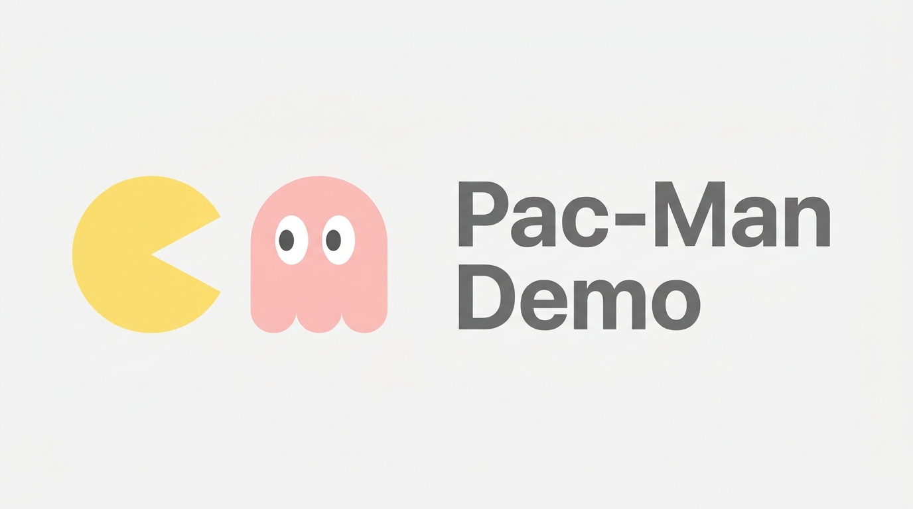
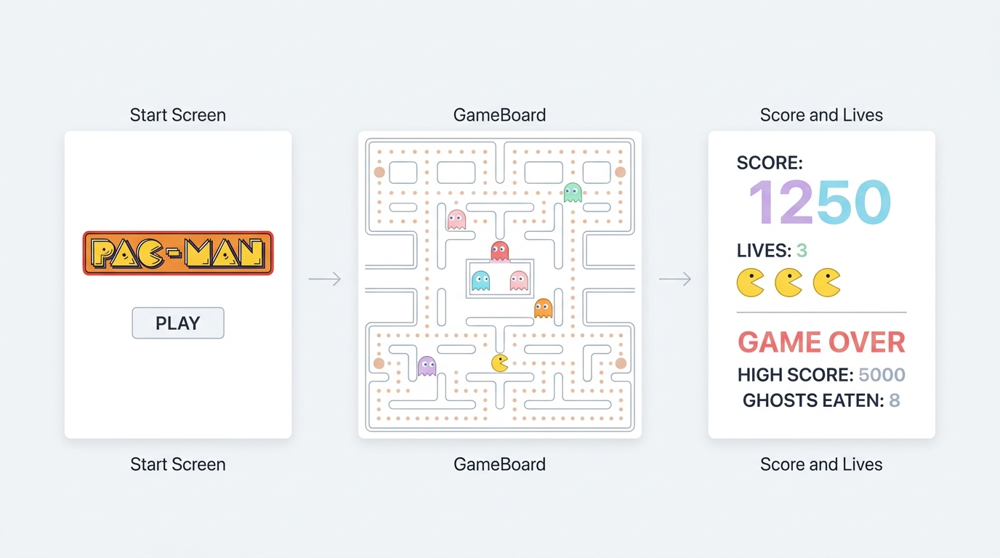

<p align="center">
  
</p>

<p align="center">
  
  
  
</p>

<p align="center">
  <strong>An elite, high-performance browser-based recreation of Pac-Man built from scratch with React, TypeScript, and HTML5 Canvas.</strong>
</p>

---

## ⚡ Quick Start

```bash
git clone https://github.com/christpor/pac-man-demo.git && cd pac-man-demo && npm install && npm run dev
```

<details>
<summary>🌐 Netlify Deployment & Configuration</summary>

The project includes a `netlify.toml` file ready for seamless continuous integration:
- **Build Command:** `npm run build`
- **Publish Directory:** `dist`

To configure a local build test, run:
```bash
npm run build && vite preview
```

</details>

---

## ✨ Highlights

- 🕹️ **Arcade-Exact Physics** — Classic 2D grid pathing mechanics, direction buffering, and collision sweeps built on HTML5 Canvas.
- 👻 **Smart Ghost AI Swarm** — Fully simulated chase, scatter, frightened, and eaten modes mirroring the original Namco logic.
- 📱 **Fluid Mobile Sweeps** — Seamless responsive grid layouts and customized swipe gesture mapping for iOS/Android gameplay.
- 🔊 **Procedural Retro Audio** — Real-time audio waveform synthesis via the Web Audio API (zero bulky external audio file dependencies).
- 🏆 **Local Persistence Grid** — Session high-score memory mapped natively to browser `localStorage`.

---

## 🏗️ System Architecture & Workflow

Pac-Man Demo operates via a single requestAnimationFrame loop triggering game updates at an authentic 10Hz tickrate, processing board rendering, and drawing updates directly onto the Canvas context.

<p align="center">
  
</p>

<details>
<summary>📂 Game Engine File Map</summary>

- `src/game/maze.ts`: Standard 2D grid matrix of walls, dots, and tunnel portals.
- `src/game/pacman.ts`: Direction, velocity vector tracking, and coordinate adjustments.
- `src/game/ghost.ts`: Pathfinding vectors toward target tiles according to individual chase/scatter/frightened algorithms.
- `src/game/useGameLoop.ts`: High-performance custom game loop wrapping.

</details>

---

## 🦾 Agent Instructions

This project uses a strict, routing-based AI context architecture. Agents working on this project must initialize by reading `GEMINI.md` and following the sequential routing order specified:

1. **`context/project_overview.md`**: Core game specifications and UI layout scope.
2. **`context/architecture.md`**: Tech stack, rendering loop lifecycle, and canvas invariants.
3. **`context/code_standards.md`**: Coding styles and lint rules.
4. **`context/workflow_rules.md`**: Action boundaries.
5. **`context/ui_context.md`**: Game theme, colors, and styling details.
6. **`context/progress_tracker.md`**: Session memory and milestone tracking.

---

## 📄 License

Proprietary License. All rights reserved. Refer to the [LICENSE](file:///home/christ/pecman-demo-project-july2026-test/LICENSE) file for usage and restriction details.
